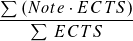

# Enhanced QIS for Hochschule Trier
Enhanced QIS verbessert das QIS-System (für die Hochschule Trier)

# Features
## Notenübersicht
Die Notenübersicht wird aufpoliert und erweitert.

Aus dem ursprünglichen Design:

Wird die verbesserte Übersicht:

- Es werden die alten farblichen Markierungen für bestandene, angemeldete, und nicht bestandene Prüfungsleistungen wieder eingeführt
- Es werden unnötige Informationen aus der Notenübersicht entfernt
    - Prüfungsrücktritte
    - Modulgruppierungen
- Es wird ein Notenschnitt ermittelt (wird in der Tabellenüberschrift "Note" angezeigt)
    - Berechnung: 